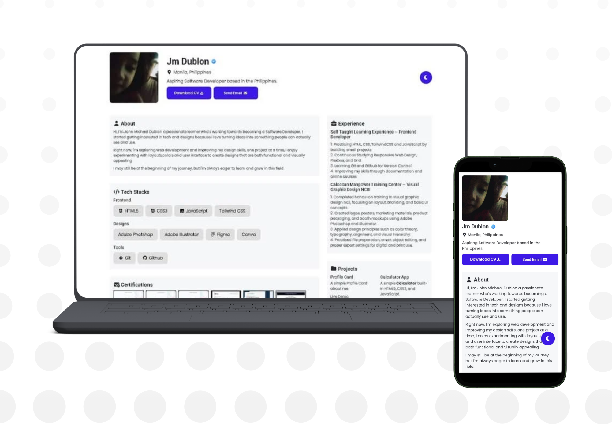

# Portfolio Website

A modern and responsive portfolio website designed to showcase my projects, skills, and my professional experience.

## 📸 Preview



## ✨ Features

- Responsive design for all devices
- Modern and clean ui
- Project showcase section
- Skills and technologies section
- Contact form
- Dark mode toggle

## ⚒️ Built With

- HTML5
- CSS3
- Vanilla Javascript

## 📂 Project Structure

```
Portfolio/
├── Assets/
│   ├── Images/
│   └── Screenshots/
├── index.html
├── license
├── main.js
├── readme.md
├── style.css
```

## 🚀 Clone the Repository

```bash
git clone https://github.com/Dublonx/Portfolio.git
